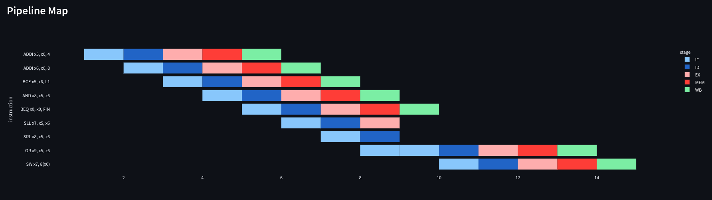
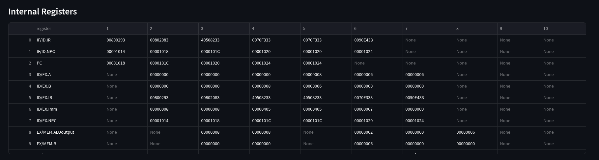
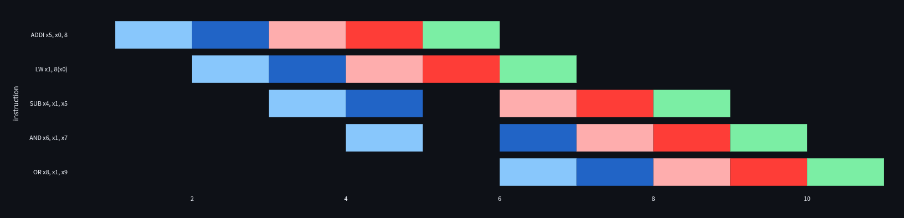

# riscv32I_Compiler(Final)
#### Members:
- Abdul Raafi M. Bandrang
- Dennis Paulo S. Delgado

**Final demo video**: [link](https://youtu.be/-2WyiwqkFhU)

**Finaldemo site**: [link](https://riscv32icompiler-icnpgctosobyj4j5rysekk.streamlit.app/) (please run the application instead in case website is down/or some execution issues)

### project updates
- implemented pipelining
- implemented Predict not taken
- implemented Data Forwarding for Load and ALU
- implemented complete pipeline map

### Nice to have had:
- extend covered instructions
- extend to other data type directives (byte and half)
- add ABI registers to the parser

### Steps to run locally
install dependencies
```pip install -r requirements.txt```

be sure to be in the working directory. 
run through streamlit cli (installed in the dependencies)
```streamlit run app.py```

#### Pipeline Map 
we've included a gant chart to display the execution of each stage of the pipeline for each instruction



#### Execution Draft
Displays each cycle for the entirety of the program and its corresponding internal registers and their value at each cycle



#### Hazard Handling
we've included Data and Control hazard handling for the pipeline.

