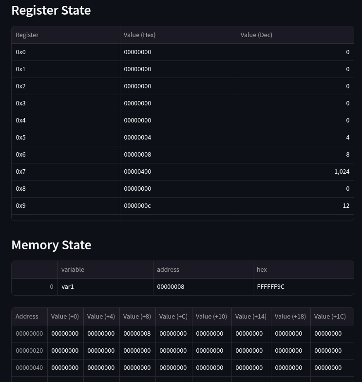
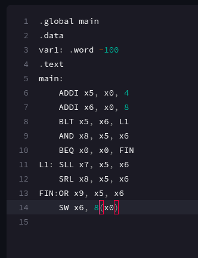
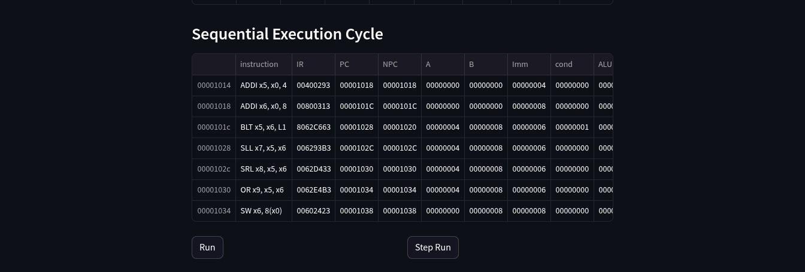

# riscv32I_Compiler(Milestone 2)
#### Members:
- Abdul Raafi M. Bandrang
- Dennis Paulo S. Delgado

**Milestone 2 demo video**: [link](https://youtu.be/3WeyeUsq2vM)

**Milestone 2 demo site**: [link](https://riscv32icompiler-7zjnzcyvmxep4zimrtq9sn.streamlit.app/) (please run the application instead in case website is down)

### project updates
- implemented gui for memory and register
- implemented sequential run
- implemented step run

### TODO:
- implement pipelining
- add schemes to handle hazards
- implement complemete pipeline map
- extend covered instructions
- extend to other data type directives (byte and half)
- add ABI registers to the parser

### Steps to run locally
install dependencies
```pip install -r requirements.txt```

be sure to be in the working directory. 
run through streamlit cli (installed in the dependencies)
```streamlit run app.py```

#### Register and Memory GUI
Displays the values for each registy and each 32 bit data segment stored in within the adress range of 0000-07FF for each step done during the build and exection


GUI           |  Script
:-------------------------:|:-------------------------:
  |  


#### Initial Execution Draft
Displays the cycle for each instruction, and breakdowns the values for the registers in each part of the execultion cycle (Instruction fetch, Instruction decode, Execution, Memory access, and Write-back).

Script            |  sequential Execution Cycle
:-------------------------:|:-------------------------:
  |  