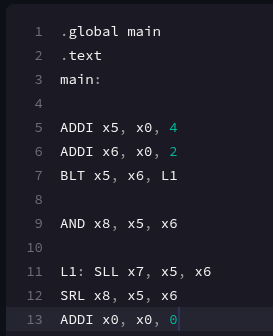
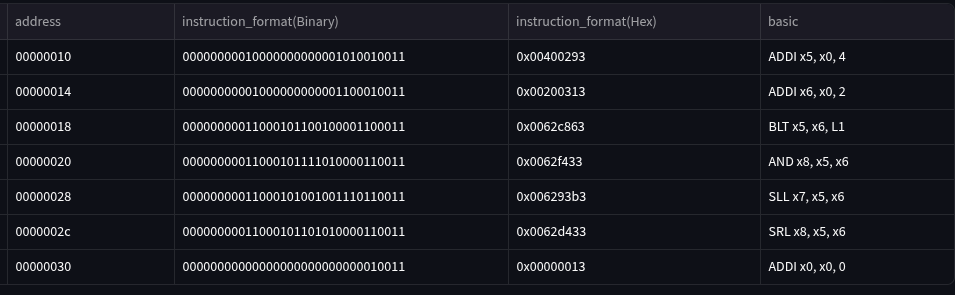
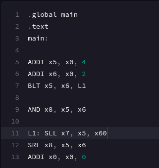
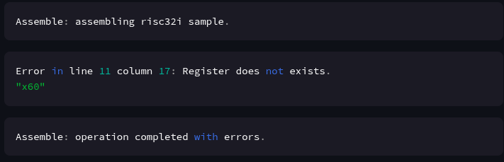

# riscv32I_Compiler(Milestone 1)
#### Members:
- Abdul Raafi M. Bandrang
- Dennis Paulo S. Delgado

**Milestone 1 demo video**: [link](https://youtu.be/lBhajLnlru8)

**Milestone 1 demo site**: [link](https://riscv32icompiler-7zjnzcyvmxep4zimrtq9sn.streamlit.app/) (please run the application instead in case website is down)

### project updates
- implemented basic error checks (basic syntax and lexical errors)
- implemented instruction format conversion module
- implmented basic EBNF grammar file using the lark library
- developed base website for compiler

### TODO:
- implement sequential run module
- implement register/data GUI
- extend covered instructions
- extend to other data type directives (byte and half)
- add ABI registers to the parser

### Steps to run locally
install dependencies
```pip install -r requirements.txt```

be sure to be in the working directory. 
run through streamlit cli (installed in the dependencies)
```streamlit run app.py```

#### Instruction Format Conversion
Supports only I,B,R,S instructions for word as of the moment. Specifcally covers the following operations: ADD, SUB, LW, SW, ADDI, SLT, SLTI, SLL, SLLI, SRL, SRLI, AND, ANDI, OR, ORI, BEQ, BNE, BLT, BGE.

Also only supports .data, .text, .word, and .global for the directives as of the moment.


ASM code             |  oppcode
:-------------------------:|:-------------------------:
  |  


#### Error Checking
Covers 4 specic error checks "Too many operands", "Not a recognized operator", "Register does not exists", and "Label does not exists". Also supports generic syntax and lexical errors with message "Incorrect Syntax" with column and line numbers.

ASM code             |  error check
:-------------------------:|:-------------------------:
  |  